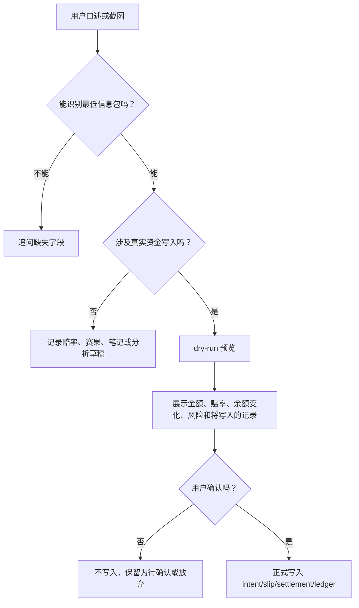

# Codex 口述与截图录入指南

## 目标

这个系统虽然有表单，但默认使用方式不是让你逐项填表。你可以用口述、短文本或截图把信息发给 Codex，由 Codex 负责识别、补全、dry-run 预览、提示缺失字段，并在你确认后写入系统。

核心原则：

- 你负责提供现场事实：比赛、盘口、金额、赔率、平台确认、赛果或结算结果。
- Codex 负责结构化：匹配比赛、识别市场、换算赔率、生成 dry-run、提示风险和缺失信息。
- 涉及真实资金的写入，默认先 dry-run；确认后才创建 slip、扣款或结算。
- 截图可以替代表单，但不能替代确认。截图识别不完整时，Codex 应先追问，不应硬写。

## 最小信息包

不同场景需要的信息不同。能一次说清下面这些，Codex 基本就能处理。

| 场景 | 必要信息 | 推荐补充 |
|---|---|---|
| 录赔率 | 比赛、平台、玩法、选项、赔率 | 截图时间、盘口线、币种 |
| 要分析 | 比赛、你关心的玩法或球队 | 可接受金额、倾向、风险偏好、你看到的盘口 |
| 创建决策 | 决策归属 User/Codex、比赛、玩法、选项、金额、赔率、理由 | 模型概率、confidence、是否真实资金 |
| 记录已成交 | 比赛、平台、玩法、选项、金额、最终赔率、注单号/确认号 | 截图、是否 User/Codex 决策、是否真实资金 |
| 记录失败执行 | 对应 intent 或比赛、失败原因 | 平台提示、赔率变化 |
| 记录赛果 | 比赛、比分或状态、来源 | 截图、结束时间 |
| 结算注单 | 注单、结果、到账/返还金额或平台结算截图 | 结算时间、cashout 金额 |
| 修正记录 | 要改哪条、原值、新值、原因 | 截图或上下文 |

## 你可以怎么说

### 1. 只给盘口，让 Codex 记录 odds snapshot

适合你还没决定下注，只是看到一个盘口。

```text
墨西哥 vs 南非，Betway，全场胜平负，墨西哥胜 1.75，平 3.50，南非胜 4.80。先记录盘口。
```

```text
这张截图是墨西哥 vs 南非的进球最多半场，选项是下半场，赔率 2.01，帮我录盘口。
```

Codex 应做：

- 匹配 `matches` 中的比赛。
- 写入 `odds_snapshots`，或先 dry-run 展示将写入的 bookmaker、market、selection、odds。
- 如果截图缺玩法或选项，先追问。

### 2. 让 Codex 做赛前分析

适合你想知道“值不值得买”，但还没下单。

```text
帮我看墨西哥 vs 南非，我倾向墨西哥，但别硬买。按现在盘口分析一下有没有价值。
```

```text
这场我想支持南非不败，你看看盘口和风险，最多按 50 元考虑。
```

```text
用 Codex 账本分析这场，模型概率你自己估，先 dry-run，不要直接创建注单。
```

Codex 应做：

- 先用本地比赛、赔率快照、资金和风控。
- 必要时查 provider、球队上下文或公开信息。
- 输出 recommendation：`bet`、`pass` 或 `wait`。
- 若要创建 intent，必须先走 dry-run。

### 3. 你已经下单了，让 Codex 从截图/口述直录

适合你在手机或投注平台已经完成下注。

```text
这单我已经下了，User 决策，真实资金。墨西哥 vs 南非，全场进球最多的半场，选下半场，50 元，赔率 2.01，注单号 example-ticket-001。
```

```text
截图里这单记到 Codex，真实资金，我代 Codex 下的。金额 20，赔率按截图，帮我先 dry-run。
```

Codex 应做：

- 优先走 `POST /api/placed-bets` 的 dry-run。
- 确认 portfolio、decision_by、placed_by、is_real_money。
- 核对金额、赔率、潜在返还、余额变化和注单号。
- 你确认后才写入 bet slip 并扣款。

### 4. 平台下单失败或赔率变了

适合你点了下注但没成交，或者最终赔率和 intent 不一致。

```text
这单没成交，平台提示赔率变成 1.68，我取消了。帮我记录失败，不扣钱。
```

```text
Codex 那条墨西哥胜 intent，最终赔率从 1.90 掉到 1.70，先别下，标记需要复核。
```

Codex 应做：

- 记录 execution_attempt。
- 不生成 slip，不扣资金。
- 如果赔率变化超过容忍区间，提示重新分析。

### 5. 赛果出来了

适合比赛结束后先记录比分，不一定马上结算。

```text
墨西哥 vs 南非 结束了，比分 2:1，来源 FIFA，帮我记录赛果。
```

```text
这场平台显示已完场，截图里比分是 0:0，先记录结果，不结算。
```

Codex 应做：

- 写入 match result。
- 如果存在 open slip，只提示待结算。
- 不自动改资金。

### 6. 平台已经结算了

适合你拿到投注平台结算结果。

```text
这张注单结算赢了，平台返还 100.50，帮我 dry-run 结算。
```

```text
墨西哥 vs 南非那张 50 元进球最多半场输了，平台已结算，按 lost 处理。
```

```text
这单提前兑现了，到账 63.20，帮我按 cashout 结算。
```

Codex 应做：

- 找到对应 bet slip。
- dry-run 预览 payout、profit/loss、结算后余额。
- 你确认后写 settlement 和 ledger。

### 7. 修正录错的数据

适合 OCR 看错、你后来发现选项/金额/赔率错了。

```text
刚才那单赔率录错了，不是 2.10，是 2.01。帮我改，理由写截图复核。
```

```text
这条墨西哥 vs 南非的盘口市场写错了，应该是 full_time:highest_scoring_half，不是 moneyline。
```

Codex 应做：

- 先定位具体记录。
- 说明会改哪些字段。
- 如果已经影响资金流水，不能静默改，需要给出修正方式或反向调整。

## 截图怎么截

### 盘口截图

尽量包含：

- 比赛名或双方球队。
- 玩法/市场名称。
- 所有相关选项和赔率；如果只截单个选项，口述补充玩法。
- 平台名。
- 截图时间或页面上能体现时间的区域。

不理想的截图：

- 只截一个赔率数字，没有比赛名。
- 只截球队名，没有玩法。
- 图片太窄，market/selection 被截掉。

### 已成交注单截图

尽量包含：

- 比赛名。
- 玩法、选项、盘口线。
- stake、final odds、potential return。
- 平台注单号/确认号。
- 成交状态，例如 accepted、confirmed、placed。
- 平台账户或平台名。

可以遮挡：

- 账号余额。
- 用户名、手机号、邮箱等私人信息。

不要遮挡：

- 注单号到完全不可识别。
- 金额、赔率、选项、状态。

### 结算截图

尽量包含：

- 原注单或比赛名。
- result：赢、输、走水、半赢、半输、cashout、cancelled。
- payout/return 或到账金额。
- 平台结算状态和时间。

如果只发比分截图，Codex 只能记录赛果，不能自动结算注单。

## Codex 收到后应该怎么处理



## Codex 追问模板

当信息不够时，优先问最少的问题。

| 缺什么 | 追问 |
|---|---|
| 不知道比赛 | “这是哪场比赛？如果列表里没有，我可以先按 matchText 记录。” |
| 不知道玩法 | “这是哪个玩法？胜平负、让球、大小球、进球最多半场，还是别的？” |
| 不知道选项 | “你买的是哪个选项？例如主胜、客队 +0.5、下半场。” |
| 不知道金额 | “stake 是多少？真实资金还是模拟？” |
| 不知道赔率格式 | “这是欧盘 decimal 还是港盘？如果截图赔率含本金，通常按 decimal。” |
| 不知道归属 | “这笔算 User 决策还是 Codex 决策？” |
| 不知道是否成交 | “这只是盘口截图，还是已经成交的注单？” |
| 不知道结算结果 | “平台最终结果是 won/lost/void/half_won/half_lost/cashout/cancelled 哪一种？” |

## 推荐短句

这些短句够用了，不需要你填表：

```text
帮我记录盘口：...
```

```text
帮我分析这场：...
```

```text
这单我已经下了，先 dry-run：...
```

```text
这单记 User / Codex：...
```

```text
这张截图是结算结果：...
```

```text
刚才那条录错了，改成：...
```

## 边界

- Codex 不应绕过 dry-run 直接写真实资金 slip 或 settlement。
- Codex 不应在截图信息不完整时猜注单。
- Codex 可以根据口述创建记录，但涉及真实资金时必须复述关键字段给你确认。
- 自动比分同步只能触发待结算提示，不能自动结算平台注单。
- 如果同一平台账户同时承载 User 和 Codex 决策，必须明确 `decision_by` 和 `portfolio_id`。
