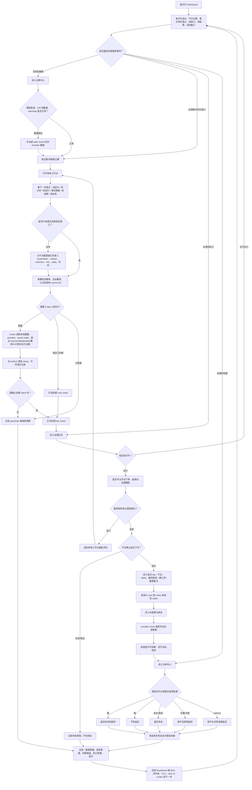
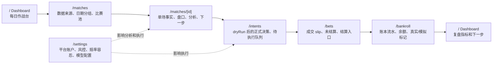
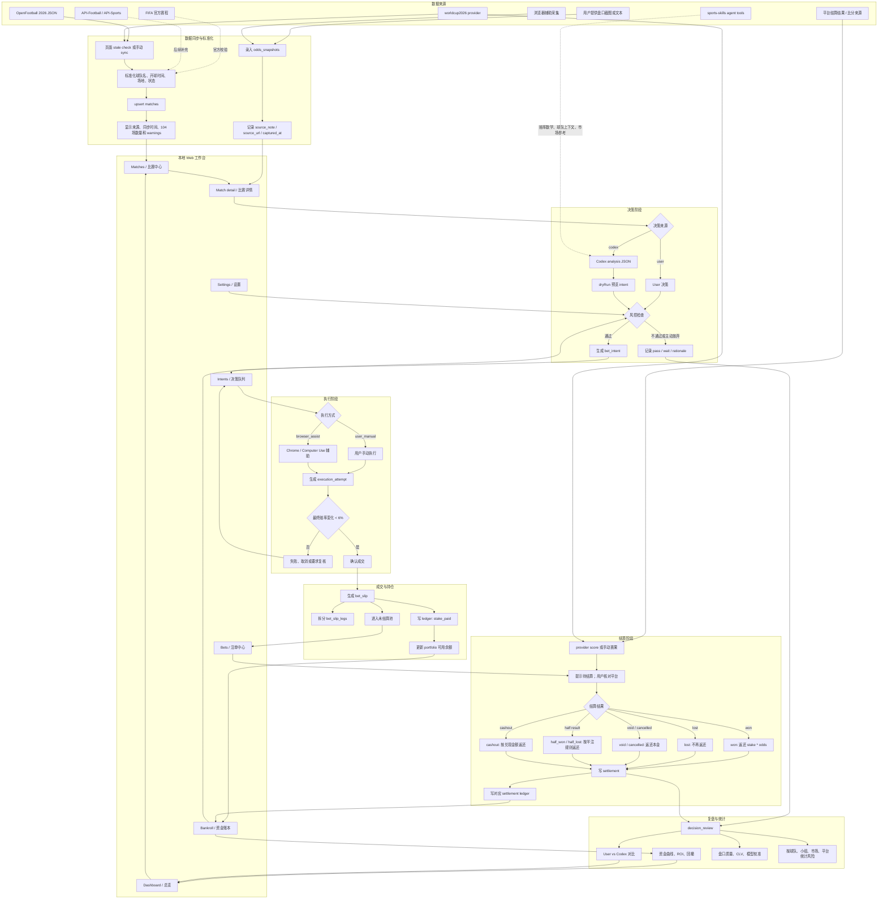

# 世界杯下注工作台流程

## 使用目标

- 记录 User 与 Codex 两套决策来源。
- 默认都是真实资金，只有明确标记为模拟时才是模拟记录。
- Codex 可以给建议，也可以在可行时通过 Chrome / Computer Use 操作；但只有确认下单成功后才生成注单并扣款。

## 用户视角全流程

这张图按你每天实际使用系统的顺序描述：先看今天要处理什么，再进入单场比赛补盘口、让 Codex 辅助分析，最后记录是否下注、是否成交、如何结算和复盘。图里的“我”就是用户本人。

## 每天怎么用

| 场景 | 你要做什么 | 系统帮你做什么 |
|---|---|---|
| 每日开局 | 打开 `/`，看今日比赛、重点待补盘口、待执行、待结算和风险敞口 | 把当天最需要处理的事项排出来 |
| 数据校验 | 打开 `/matches`，看来源、同步时间、104 场数量和 warnings | 同步 provider 数据；来源异常时不静默覆盖 |
| 盘口记录 | 进入 `/matches/[id]`，把平台上看到的盘口、赔率、时间录进去 | 保存赔率快照，并计算隐含概率、去水概率、公允赔率和 overround |
| Codex 分析 | 在单场工作台生成分析草稿 | 输出 sources、dataQuality、概率、EV、风险、建议和反方证据；先 dryRun |
| 决策确认 | 你确认 User 或 Codex intent 是否正式创建 | 只有确认后才写 `bet_intent`，观察或 pass 也留痕 |
| 执行 | 到平台手动下单，或用浏览器辅助 | 记录执行尝试；赔率变化过大时要求复核 |
| 成交 | 平台确认下单成功后录入注单 | 扣对应 `user` 或 `codex` 账本的 stake |
| 赛果提示 | provider score 或你手动记录赛果 | 只提示待结算，不自动结算或改动资金 |
| 赛后结算 | 核对平台后录入赢、输、走水、半赢半输或 cashout | 自动写结算和资金流水 |
| 复盘 | 看哪些判断有效、哪些盘口买贵了 | 汇总 ROI、命中率、CLV、概率校准、User vs Codex 和风险敞口 |

## 页面使用顺序

## 系统背后的保障流程

下面这张图是内部数据如何支撑你的操作。日常使用时优先看上面的用户流程；这里用于解释为什么账本、注单和复盘能追溯。

## 关键数据流

| 阶段 | 主要输入 | 写入表 | 资金影响 |
|---|---|---|---|
| 赛程同步 | FIFA / OpenFootball / worldcup2026 provider | `matches` | 无 |
| 赔率快照 | 用户文本、截图、浏览器采集 | `odds_snapshots` | 无 |
| Codex 分析 | 本地比赛、赔率、资金、provider、sports-skills | 不写库；先返回 analysis JSON 和 dryRun 预览 | 无 |
| 决策确认 | 比赛、盘口、概率、理由、风控、用户确认 | `bet_intents`、`bet_intent_legs` | 无 |
| 执行尝试 | 执行方式、观察赔率、失败原因 | `execution_attempts` | 无 |
| 成交确认 | 平台账户、stake、最终赔率、确认号 | `bet_slips`、`bet_slip_legs`、`portfolio_ledger_entries` | 扣 stake |
| 赛果提示 | provider score、手动赛果、平台状态 | `match_results` | 无 |
| 结算 | 用户核对后的平台结算、截图或口述 | `settlements`、`portfolio_ledger_entries` | 按结算结果返还 |
| 复盘 | 结果、盘口变化、模型判断 | `decision_reviews` | 无 |

## 页面到流程映射

| 页面 | 当前职责 |
|---|---|
| `/` Dashboard | 每日作战台：今日比赛、重点待补盘口、待执行、待结算、风险敞口和复盘指标 |
| `/matches` 比赛中心 | 查看同步面板、来源、warnings、104 场比赛池和日期分组 |
| `/matches/[id]` 比赛详情 | 单场工作台：事实、盘口、Codex 分析、下一步、赛果和待结算提示 |
| `/intents` 决策队列 | 管理 dryRun 确认后的 User/Codex 下注意图和执行入口 |
| `/bets` 注单中心 | 查看成交注单、未结算池和人工结算入口 |
| `/bankroll` 资金账本 | 管理 User/Codex 额度、查看资金流水 |
| `/settings` 设置 | 管理平台账户、风控参数、赔率容忍和模型配置 |

## 不变量

- `bet_intent` 不扣钱。
- `execution_attempt` 不扣钱。
- Codex analysis 和 `dryRun` 不写真实资金记录。
- 只有 `bet_slip` 创建成功后才扣 stake。
- 只有 `settlement` 决定最终盈亏。
- provider score 或自动比分同步只能提示待结算，不能自动结算注单。
- `placed_by=user` 只表示执行人，不表示决策归属。
- `portfolio_id=user|codex` 决定资金归属。
- 默认 `is_real_money=true`；只有明确选择模拟时才是模拟记录。
- 赔率变化达到或超过容忍阈值时，必须回到决策复核，不能直接沿用旧 intent。

## 支持玩法

| 维度 | 当前支持 |
|---|---|
| 时间段 | 全场、半场 |
| 市场 | 胜平负、让球、大小球、第 N 个进球球队、串关 |
| 结算 | 赢、输、走水、半赢、半输、提前兑现、取消/无效 |

## 信息不完整时必须提示

创建或结算记录前，如果缺少这些信息，需要提示用户补充或标记为未知：

- 比赛：哪一场，或至少双方球队和开球时间。
- 市场：全场/半场，胜平负/让球/大小球/第 N 球/串关。
- 选择：买哪一边，例如阿根廷胜、大 2.5、第 1 球巴西。
- 金额、赔率、平台账户。
- 是否真实资金；默认真实。
- 平台注单号或截图备注。
- 结算依据：平台已结算、比分来源、截图或用户口述。

## 下注成功前不扣款

`bet_intent` 和 `execution_attempt` 都不改变资金。只有确认成交后生成 `bet_slip` 才扣款。
