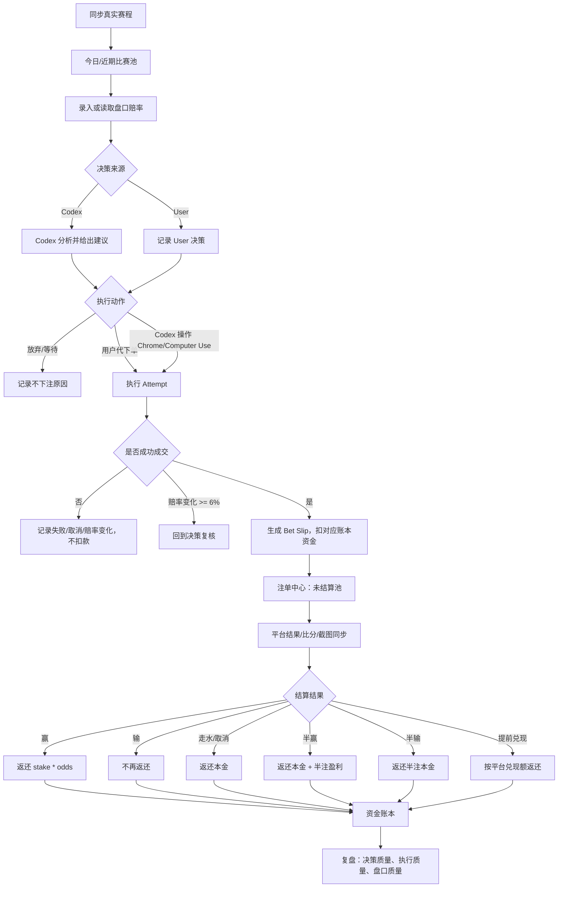

# 世界杯下注工作台流程

## 使用目标

- 记录 User 与 Codex 两套决策来源。
- 默认都是真实资金，只有明确标记为模拟时才是模拟记录。
- Codex 可以给建议，也可以在可行时通过 Chrome / Computer Use 操作；但只有确认下单成功后才生成注单并扣款。

## 主流程

## 支持玩法

| 维度 | 当前支持 |
|---|---|
| 时间段 | 全场、半场 |
| 市场 | 胜平负、让球、大小球、第 N 个进球球队、串关 |
| 结算 | 赢、输、走水、半赢、半输、提前兑现、取消/无效 |

## 信息不完整时必须提示

创建或结算记录前，如果缺少这些信息，需要提示用户补充或标记为未知：

- 比赛：哪一场，或至少双方球队和开球时间。
- 市场：全场/半场，胜平负/让球/大小球/第 N 球/串关。
- 选择：买哪一边，例如阿根廷胜、大 2.5、第 1 球巴西。
- 金额、赔率、平台账户。
- 是否真实资金；默认真实。
- 平台注单号或截图备注。
- 结算依据：平台已结算、比分来源、截图或用户口述。

## 下注成功前不扣款

`bet_intent` 和 `execution_attempt` 都不改变资金。只有确认成交后生成 `bet_slip` 才扣款。
